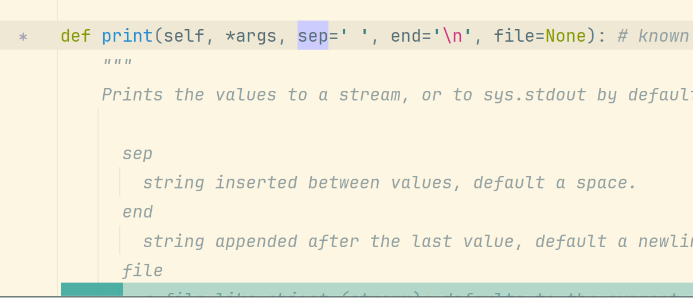
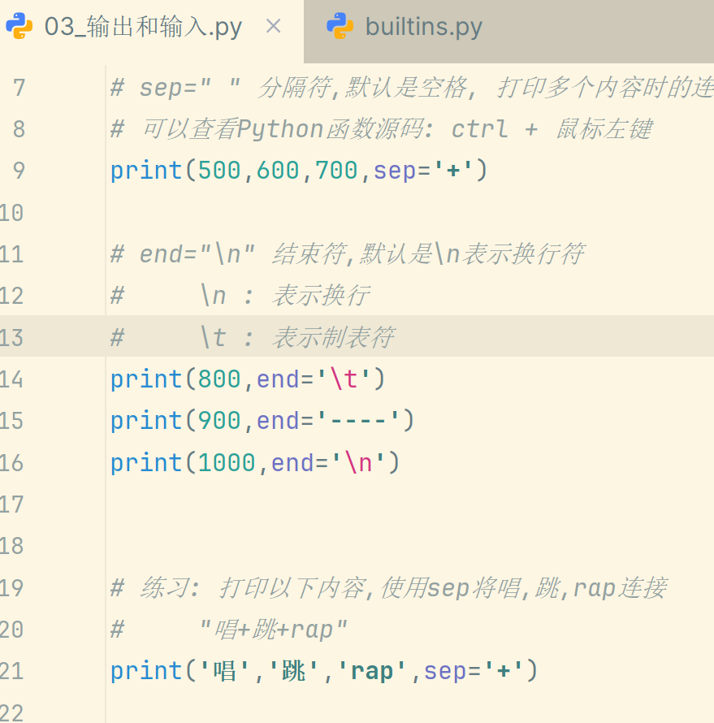

# 预习3：python语法

* 注释  #  ''' ''' """ """这三种
* print输出
	按住ctrl并点击print可以查看源代码，里面有一些参数可以使用
	
	接下来可以传参数，比如传sep或者end可以修改输出内容
	
 * 输入
	 input()会得到一个str字符串类型,如果输入的是数字,则需要使用int()或float()来转换,type()可以查看类型
 * 